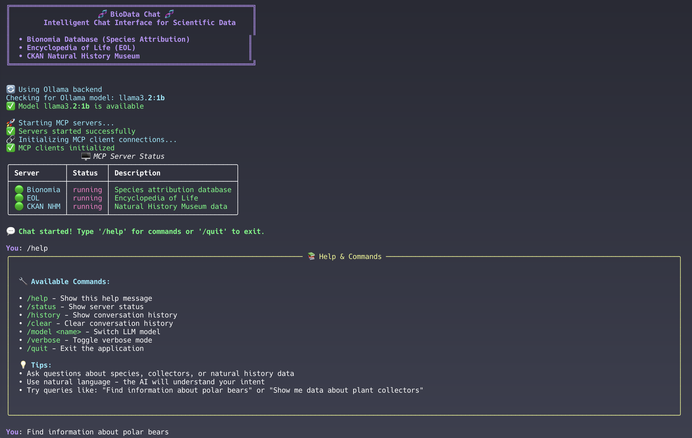

# 🧬 BioData Chat



**Intelligent Terminal Interface for Scientific Database Interaction**

BioData Chat is a sophisticated terminal application that enables natural language interaction with multiple scientific databases through MCP (Model Context Protocol) servers, powered by local LLM models for privacy and efficiency.

## 🌟 Overview

This application provides seamless access to three major scientific databases:

- **🔬 Bionomia Database** - Species attribution and collector information
- **🌍 Encyclopedia of Life (EOL)** - Comprehensive species data, traits, and ecological interactions  
- **🏛️ CKAN Natural History Museum** - Museum datasets and collections

## ✨ Features

### 🎨 User Experience
- **Rich Terminal Interface** - Beautiful, colorful CLI using the `rich` library
- **Interactive Chat Mode** - Natural language conversations with scientific data
- **Status Monitoring** - Real-time server status and health checks
- **Progress Indicators** - Visual feedback for long-running operations

### 🔧 Technical Capabilities
- **MCP Server Integration** - Orchestrates multiple database servers automatically
- **Dual LLM Backend Support** - Primary llamafile backend with Ollama fallback for maximum compatibility
- **Resource Efficiency** - Optimized for local execution with lightweight models
- **Verbose Logging** - Detailed debugging information when needed
- **Error Handling** - Graceful error recovery and user-friendly messages

### 🎯 Smart Features
- **Flexible Model Selection** - Choose from various LLM models via command-line arguments
- **Conversation History** - Maintains context across chat sessions
- **Runtime Model Switching** - Change LLM models on-the-fly during chat
- **Dependency Checking** - Automatic validation of required components
- **Server Management** - Integrated start/stop/restart functionality
- **🧠 Advanced ReAct Reasoning** - Multi-step reasoning for complex research questions
- **🔬 Systematic Research** - Automated database querying with evidence synthesis
- **📊 Research Trace Visualization** - View the AI's reasoning steps and decision process

## 🚀 Quick Start

### Prerequisites

1. **Python 3.11+** - Required for all dependencies
2. **LLM Backend** - The application supports two backends:
   - **llamafile** (Primary) - Automatically downloaded lightweight LLM executable
   - **Ollama** (Secondary) - Install from [ollama.ai](https://ollama.ai) for alternative backend
     ```bash
     # Install Ollama (macOS)
     brew install ollama
     ollama serve
     ```

3. **System Dependencies**:
   - `curl` - For downloading llamafile components
   - `chmod` - For setting script permissions

### Installation

#### Option 1: Development Container (instable; WIP)

The easiest way to get started is using the pre-configured development container:

1. **Prerequisites:**
   - [Docker](https://www.docker.com/get-started) installed
   - [VS Code](https://code.visualstudio.com/) with [Dev Containers extension](https://marketplace.visualstudio.com/items?itemName=ms-vscode-remote.remote-containers)

2. **Open in container:**
   ```bash
   git clone https://github.com/steffenvogler/Biodata-chat.git
   cd Biodata-chat
   code .
   ```
   Then click "Reopen in Container" when prompted.

3. **Everything is pre-configured:**
   - ✅ Python 3.11 with all dependencies
   - ✅ Ollama pre-installed and configured
   - ✅ Development tools ready
   - ✅ VS Code extensions loaded

#### Option 2: Local Installation

1. **Clone the repository:**
   ```bash
   git clone https://github.com/steffenvogler/Biodata-chat.git
   cd Biodata-chat
   ```

2. **Install Python dependencies:**
   ```bash
   pip install -r requirements.txt
   ```
   This installs all required dependencies including:
   - `click`, `rich`, `requests` (core dependencies)
   - `ollama` (LLM backend)
   - `bananompy` (enhanced Bionomia integration)

3. **Make scripts executable:**
   ```bash
   chmod +x biodata_chat.py
   chmod +x manage_servers.sh
   ```

### Running the Application

1. **Basic usage:**
   ```bash
   ./biodata_chat.py
   ```

2. **With verbose logging:**
   ```bash
   ./biodata_chat.py --verbose
   ```

3. **Using a specific model:**
   ```bash
   ./biodata_chat.py --model "Custom Model Name"
   ```

4. **Backend selection with model:**
   ```bash
   ./biodata_chat.py --backend ollama --model "LLaMA 3.2 1B Instruct" --verbose
   ```

## 📖 Usage Guide

### Starting a Chat Session

When you run the application, it will:

1. 🔍 Check all dependencies
2. 🎯 Configure the selected model for the chosen backend
3. 📥 Download required LLM model (if needed)
4. 🚀 Start MCP servers automatically
5. 🔗 Initialize database connections
6. 💬 Launch interactive chat mode

### Available Commands

| Command | Description |
|---------|-------------|
| `/help` | Show all available commands and usage tips |
| `/status` | Display current MCP server status |
| `/history` | Show recent conversation history |
| `/clear` | Clear conversation history |
| `/model <name>` | Switch to a different model (runtime) |
| `/verbose` | Toggle verbose logging on/off |
| `/reasoning` | Toggle advanced ReAct reasoning mode |
| `/quit` | Exit the application safely |

### 🧠 Advanced Reasoning + Acting (ReAct) Paradigm

BioData Chat implements a sophisticated **ReAct (Reasoning + Acting)** paradigm for handling complex research questions that require multi-step analysis and systematic database exploration.

#### What is ReAct?

ReAct is an advanced AI reasoning framework that combines:
- **💭 Thought**: Strategic planning and reasoning about the research question
- **⚙️ Action**: Systematic execution of database queries and analysis
- **🔍 Observation**: Critical evaluation of gathered evidence
- **🧘 Reflection**: Assessment of progress and strategy adjustment
- **🔬 Synthesis**: Integration of findings into comprehensive answers

#### When ReAct Activates

The system automatically analyzes questions for:
- **Complexity Level**: High, medium, or low complexity detection
- **Domain Classification**: Taxonomy, ecology, collections, morphology, etc.
- **Multi-Database Requirements**: Questions requiring cross-database research
- **Research Depth**: Questions needing systematic investigation

#### ReAct Research Process

1. **📊 Question Analysis**
   - Domain classification (taxonomy, ecology, collections, etc.)
   - Complexity assessment (low/medium/high)
   - Database requirement identification
   - Sub-question decomposition

2. **🗺️ Research Strategy Planning**
   - Multi-step research plan development
   - Database query prioritization
   - Evidence synthesis strategy

3. **🔄 Iterative Research Loop**
   - **Thought**: Plan next research action
   - **Action**: Execute database queries or analysis
   - **Observation**: Evaluate results and evidence quality
   - **Reflection**: Assess progress and adjust strategy

4. **📝 Evidence Synthesis**
   - Cross-database information integration
   - Confidence assessment of findings
   - Comprehensive answer compilation

#### Example ReAct Flow

```
💬 User: "Compare the ecological roles of polar bears and penguins in their respective ecosystems"

💭 Thought: This is a high complexity comparative analysis requiring ecological data 
         from multiple sources about Arctic and Antarctic ecosystems.

⚙️ Action: Query EOL database for polar bear ecological interactions and habitat data

🔍 Observation: Found comprehensive data on polar bear predatory relationships, 
             sea ice dependency, and Arctic food web position.

💭 Thought: Need similar data for penguins to enable meaningful comparison.

⚙️ Action: Query EOL database for penguin species ecological roles and Antarctic data

🔍 Observation: Gathered data on penguin feeding behaviors, breeding patterns, 
             and Antarctic ecosystem relationships.

🧘 Reflection: Have sufficient data from both Arctic and Antarctic ecosystems. 
            Ready to synthesize comparative analysis.

🔬 Synthesis: [Comprehensive comparison with ecosystem roles, conservation 
            status, climate change impacts, and evolutionary adaptations]
```

#### Enabling ReAct Mode

```bash
# Enable during chat session
/reasoning

# Check status
/help  # Shows ReAct availability and current status
```

#### ReAct Features

- **📊 Domain Intelligence**: Automatically recognizes research domains and selects appropriate databases
- **🗺️ Multi-Step Planning**: Breaks complex questions into manageable research steps
- **🔗 Cross-Database Integration**: Synthesizes information from multiple scientific databases
- **🔍 Evidence Assessment**: Evaluates confidence levels and information quality
- **📝 Research Traceability**: Provides detailed reasoning traces in verbose mode
- **⚙️ Adaptive Strategy**: Adjusts research approach based on intermediate findings
- **🧠 LLM-Powered Synthesis**: Uses actual LLM backends for deep reasoning and synthesis
- **🔄 Context Accumulation**: Builds knowledge iteratively across reasoning steps
- **🔍 Relationship Analysis**: Identifies complex ecological, taxonomic, and geographic relationships
- **❓ Follow-up Generation**: Automatically generates relevant research questions based on findings

#### Best Use Cases for ReAct

- 🔬 **Comparative Studies**: "Compare ecological niches of similar species"
- 🌍 **Cross-Domain Research**: "Relationship between climate and species distribution"
- 📈 **Temporal Analysis**: "How have collection patterns changed over time?"
- 🗺️ **Geographic Studies**: "Species diversity across different bioregions"
- 🔗 **Complex Relationships**: "Interaction networks in specific ecosystems"

### Example Queries

Try asking questions like:

- 🐻 *"Find information about polar bears"*
- 🌸 *"Show me data about plant collectors"*
- 🦋 *"What ecological interactions involve butterflies?"*
- 📊 *"Search for datasets about marine biodiversity"*
- 👨‍🔬 *"Who collected specimens in Madagascar?"*

## 🏗️ Architecture

### MCP Servers

The application manages three specialized MCP servers:

1. **Bionomia Server** (`bananompy_server.py`)
   - Collector search and attribution
   - Species occurrence data

2. **EOL Server** (`eol_server.py`)
   - Species information and media
   - Taxonomic hierarchies
   - Ecological traits and interactions

3. **CKAN Server** (`ckan_server.py`)
   - Dataset discovery
   - Collection browsing
   - Resource metadata

### Server Management

The `manage_servers.sh` script provides:
- **Start:** Launch all MCP servers
- **Stop:** Gracefully shut down servers  
- **Restart:** Stop and restart all servers
- **Pause:** Suspend server processes
- **Continue:** Resume suspended servers

## 🔧 Configuration

### Model Selection

The application defaults to **"LLaMA 3.2 1B Instruct"** for optimal resource efficiency. The model name is intelligently mapped to the appropriate format for each backend:

- **llamafile backend**: `Llama-3.2-1B-Instruct.Q6_K.llamafile`
- **Ollama backend**: `llama3.2:1b`

#### Command-Line Model Selection

```bash
# Use default model (LLaMA 3.2 1B Instruct)
./biodata_chat.py

# Specify custom model
./biodata_chat.py --model "Custom Model Name"

# Use with specific backend
./biodata_chat.py --backend ollama --model "LLaMA 3.2 1B Instruct"

# Larger models (adjust based on your system capabilities)
./biodata_chat.py --model "LLaMA 3.2 3B Instruct"
./biodata_chat.py --model "CodeLlama 7B"
```

#### Available Options

| Option | Short | Description | Default |
|--------|--------|-------------|----------|
| `--model` | `-m` | Model name to use | "LLaMA 3.2 1B Instruct" |
| `--backend` | `-b` | Backend (llamafile/ollama) | llamafile |
| `--verbose` | `-v` | Enable detailed logging | False |

### Verbose Mode

Enable detailed logging for troubleshooting:

```bash
./biodata_chat.py --verbose
```

Or toggle during runtime with `/verbose` command.

## 🛠️ Development

### File Structure

```
Biodata-chat/
├── biodata_chat.py              # Main application
├── manage_servers.sh            # Server orchestration script
├── requirements.txt             # Python dependencies
├── Screenshot.png               # Application screenshot
├── README.md                    # This documentation
├── src/
│   ├── local_fastmcp/           # Local MCP implementation
│   │   ├── __init__.py         # FastMCP and Client classes
│   │   ├── bananompy_server.py # Bionomia MCP server
│   │   ├── eol_server.py       # EOL MCP server
│   │   └── ckan_server.py      # CKAN MCP server
│   └── reasoning/               # Advanced reasoning module
│       ├── __init__.py         # Reasoning module exports
│       └── react_agent.py      # ReAct reasoning agent
```

### BYOD - Bring you own Databases

To integrate additional scientific databases:

1. Create a new MCP server script in `src/local_fastmcp/`
2. Add server management to `manage_servers.sh`
3. Update the client initialization in `biodata_chat.py`
4. Extend the system prompt with database context

## 🐛 Troubleshooting

### Common Issues

**Ollama not responding:**
```bash
# Check if Ollama is running
ollama list

# Start Ollama service
ollama serve
```

**MCP servers won't start:**
```bash
# Check script permissions
chmod +x manage_servers.sh

# Test manually
./manage_servers.sh start
```

**Missing dependencies:**
```bash
# Reinstall requirements
pip install -r requirements.txt --force-reinstall
```

### Error Messages

The application provides detailed error messages with suggested solutions. Use `--verbose` flag for additional diagnostic information.

## 📄 License

This project extends FastMCP and follows its licensing terms. Please refer to the FastMCP license for details.

## 🙏 Acknowledgments

- **Warp** - Provides the Agentic Development Environment
- **FastMCP** - Provides the MCP server framework
- **Ollama** - Local LLM execution platform
- **Rich** - Beautiful terminal interfaces
- **Scientific Databases** - Bionomia, EOL, and CKAN for their open APIs

---

*Built with ❤️ for the scientific research community*
